<!-- ══════════════════════════════════════════════════════════
     DEEPESH AHLAWAT — GitHub Profile README (fixed build)
     ══════════════════════════════════════════════════════════ -->

<!-- ─── ANIMATED BANNER ─── -->
<div align="center">
  
</div>

<!-- ─── TYPING SVG  (demolab, text-safe URL, no raw emojis/apostrophes) ─── -->
<div align="center">
  
</div>

<br/>

<!-- ─── SOCIAL BADGES ─── -->
<div align="center">
  <a href="https://www.linkedin.com/in/deepesh-ahlawat/"></a>&nbsp;
  <a href="mailto:deepeshahlawat001@gmail.com"></a>&nbsp;
  <a href="https://twitter.com/webdevdeep"></a>&nbsp;
  
</div>

<br/>

---

<!-- ─── YAML BIO ─── -->
```yaml
name        : Deepesh Ahlawat
role        : Agentic AI Engineer & ML Researcher
location    : New Delhi, India
education   : B.Tech @ GGSIPU  |  CGPA: 9.412  |  University Rank 3
status      : Open to full-time AI/ML roles & internships

awards:
  - "🥇 International 1st Prize  — Baidu PaddleOCR Competition (2026)  [$1,000]"
  - "🥇 National 1st Prize       — ISRO Bharatiya Antariksh Hackathon BAH'25"
  - "🏅 National Rank 70         — Amazon ML Challenge (2025)"
  - "🥇 1st Place                — TechGenesis 2.0 Hackathon (2025)"

currently_building:
  - Multi-step autonomous agents with LangGraph @ ConnectHEOR, London
  - Agentic RAG pipelines for healthcare evidence synthesis

superpowers:
  - "Agentic AI  |  LangChain / LangGraph  |  RAG & GraphRAG"
  - "PyTorch  |  Computer Vision  |  Physics-Informed Neural Networks"
  - "FastAPI  |  AWS  |  Oracle Cloud  |  Pinecone  |  Docker"
```

---

<!-- ─── TROPHIES  (mirror URL — main vercel is rate-limited) ─── -->
<div align="center">
  
</div>

---

<!-- ─── FEATURED PROJECTS ─── -->
## 🚀 Featured Projects

<table>
  <tr>
    <td width="50%" valign="top">
      <h3>🏆 <a href="https://github.com/deepeshahlawat/Chronos-VL">Chronos-VL</a></h3>
      <p><em>International 1st Prize — Baidu PaddleOCR 2026</em></p>
      <p>Vision-Language Model pipeline on Baidu's 0.9B NaViT architecture. Extracts text from degraded 16th-century Gothic manuscripts.</p>
      <p><strong>76× accuracy improvement</strong> — CER dropped from <code>19.82%</code> → <code>1.64%</code></p>
      <p>
        
        
        
      </p>
    </td>
    <td width="50%" valign="top">
      <h3>🛰️ CME Detection Neural Net</h3>
      <p><em>National 1st Prize — ISRO BAH'25 · Awarded by Minister of Space</em></p>
      <p>Physics-Informed Neural Network for Coronal Mass Ejection detection. Outperformed state-of-the-art ARCANE systems.</p>
      <p><strong>94.5% True Negative Rate</strong> · <strong>63.1% Detection Rate</strong></p>
      <p>
        
        
        
      </p>
    </td>
  </tr>
  <tr>
    <td width="50%" valign="top">
      <h3>🤖 RagFin AI</h3>
      <p><em>Agentic Document Assistant</em></p>
      <p>Agentic RAG assistant for multi-step reasoning, dense document extraction, and structured report generation for fintech workflows.</p>
      <p>
        
        
        
        
      </p>
    </td>
    <td width="50%" valign="top">
      <h3>🏥 Healthcare Evidence Agent</h3>
      <p><em>@ ConnectHEOR, London (Jan–Jun 2026)</em></p>
      <p>Multi-step autonomous LangGraph agents for healthcare document reasoning. Full audit-trail logging from prompt → output.</p>
      <p>
        
        
        
      </p>
    </td>
  </tr>
</table>

---

<!-- ─── TECH STACK ─── -->
## 🛠️ Tech Stack

**🤖 AI / ML Core**


**🦜 Agentic AI & LLMs**


**☁️ Cloud & DevOps**


**🌐 Frontend & Backend**


---

<!-- ─── GITHUB STATS ─── -->
## 📊 GitHub Stats

<div align="center">
  
  &nbsp;&nbsp;
  
</div>

<br/>

<div align="center">
  
</div>

---

<!-- ─── ACTIVITY GRAPH ─── -->
## 📈 Contribution Activity

<div align="center">
  
</div>

---

<!-- ─── SNAKE  (needs the Action below to be set up first — see instructions) ─── -->
## 🐍 My Commits, Eaten Alive

<div align="center">
  <picture>
    <source media="(prefers-color-scheme: dark)"  srcset="https://raw.githubusercontent.com/deepeshahlawat/deepeshahlawat/output/github-snake-dark.svg"/>
    <source media="(prefers-color-scheme: light)" srcset="https://raw.githubusercontent.com/deepeshahlawat/deepeshahlawat/output/github-snake.svg"/>
    
  </picture>
</div>

---

<!-- ─── FOOTER ─── -->
<div align="center">
  
</div>

<div align="center">
  <em>⚡ "The model is never done training." ⚡</em>
</div>
